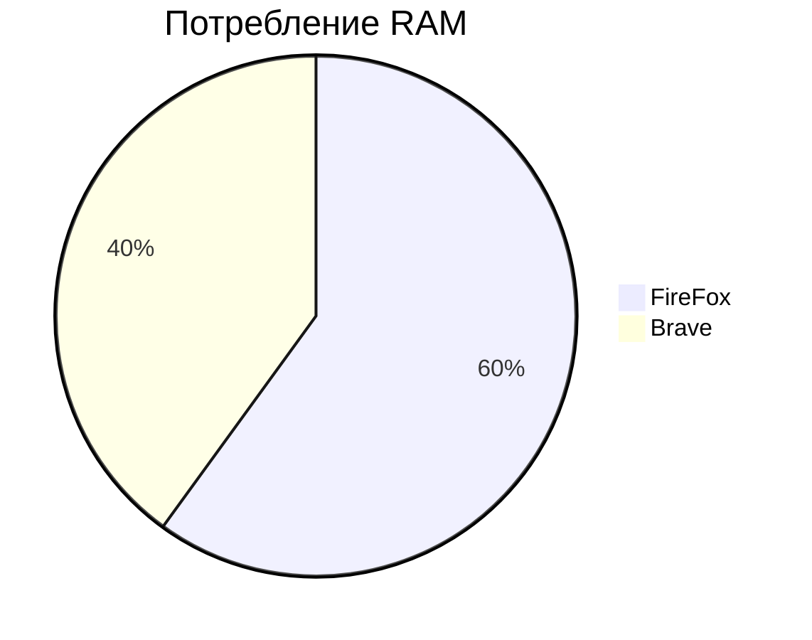
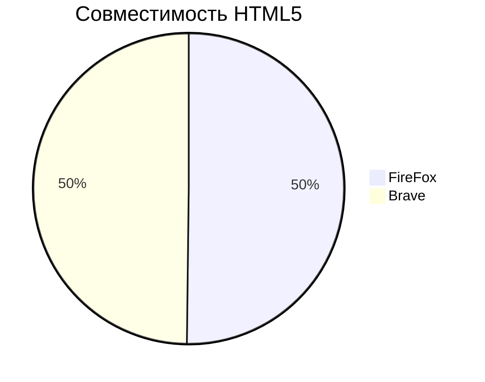
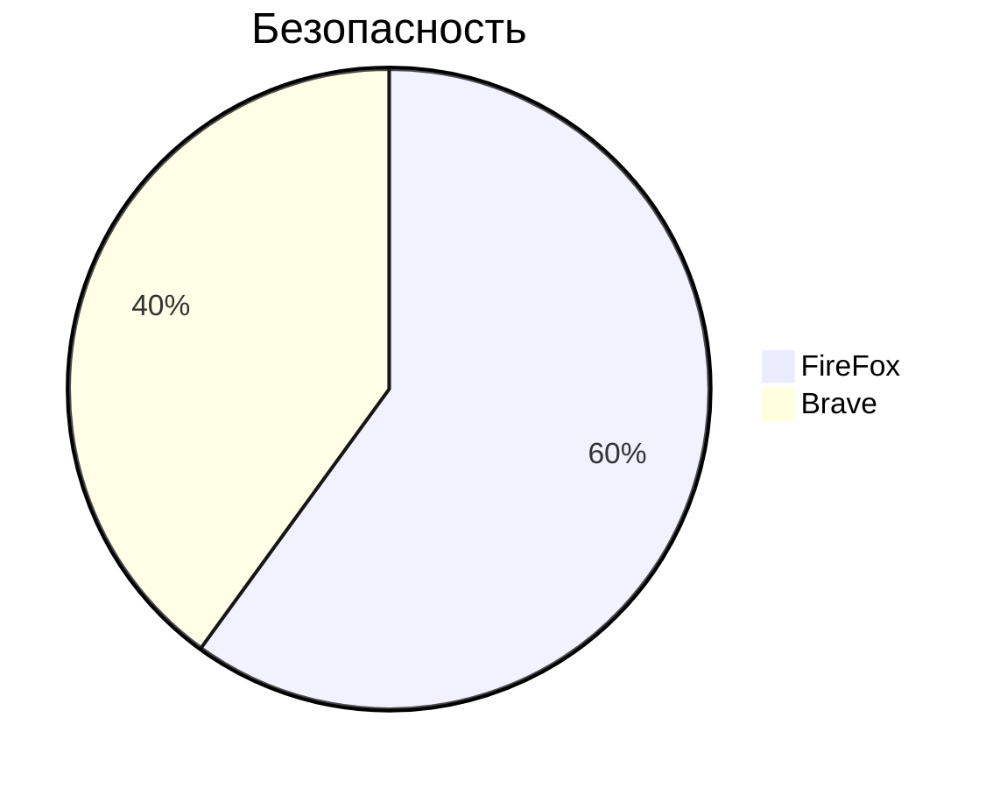
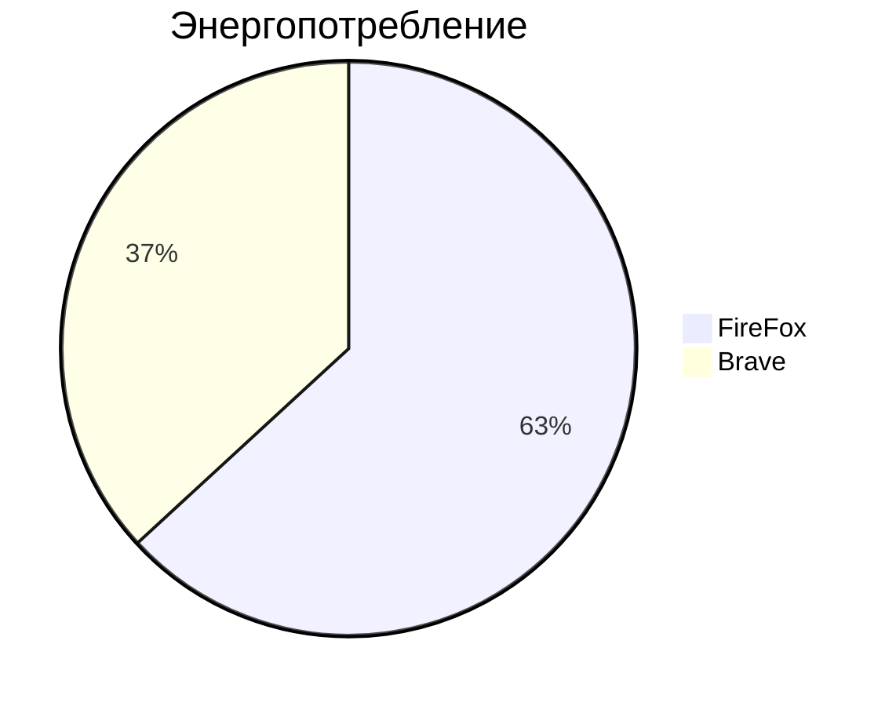

# Сравнительный анализ браузеров FireFox и Brave

|Критерий|FireFox|Brave|Метод измерения|
|--------|-------|-----|---------------|
|Потребление RAM|1.8 GB|1.2 GB|Task Manager|
|Совместимость|528 / 555| 534 / 555|HTML5Test.com|
|Безопасность|Tranco Rank: 15000|Tranco Rank: 10000|Tranco|
|Энергопотребление|-12%|-7%|Battery Report|

